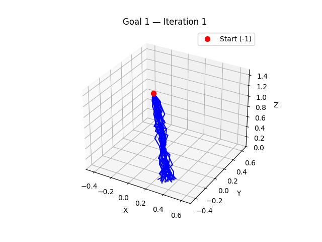

# MPPI-Based Non-Prehensile Manipulation

This project implements a sampling-based Model Predictive Path Integral (MPPI) controller for non-prehensile manipulation using a 7-DOF robotic manipulator. The core idea is to use a physics simulator (PyBullet) as the dynamics model, eliminating the need for analytical models or offline learning. Several MPPI variants are explored, including standard MPPI, Cartesian-space sampling, and adaptive waypoint-based control. The goal is to push an object to a desired goal position while handling contact-rich dynamics in real time.

---

## Folder Structure

- `data/`  
  Contains `.csv` files that log joint angles, end-effector positions, costs, collision flags, and other rollout statistics generated during experiments.

- `plots/`  
  Contains result plots organized by MPPI variant.   
  Each subfolder corresponds to a specific controller version (e.g., standard MPPI, Cartesian sampling, or adaptive waypoints).   
  Includes performance visualizations such as convergence graphs, trajectory rollouts, and error metrics.

- `reports/`  
  Includes final project reports and LaTeX-compiled PDFs summarizing methodology, results, and analysis.

- `resources/`  
  Contains supporting materials such as reference papers, GIFs of simulation runs, and illustrative images used in the report or presentations.

- `scripts/`  
  - `scripts/main/`   
        Main codebase for MPPI development and experimentation:    
        Includes all finalized Python scripts for the working MPPI implementations.  
  
  - other files `scripts/` contain test scripts, utility modules, and experimental implementations developed during the prototyping phase.

## Demonstration

<!-- Row 1 -->

<strong>Standard MPPI Rollouts:</strong>

<table>
  <tr>
    <td></td>
    <td style="width: 40px;"></td> <!-- Horizontal gap -->
    <td></td>
  </tr>
</table>

  <!-- Vertical gap -->

<!-- Row 2 -->

<strong>Cartesian MPPI Sampling Results:</strong>

<table>
  <tr>
    <td></td>
    <td style="width: 40px;"></td>
    <td></td>
  </tr>
</table>

 

<!-- Row 2 -->

<strong>MPPI with Zeros Initialization:</strong>

<table>
  <tr>
    <td></td>
    <td style="width: 40px;"></td>
  </tr>
</table>

 